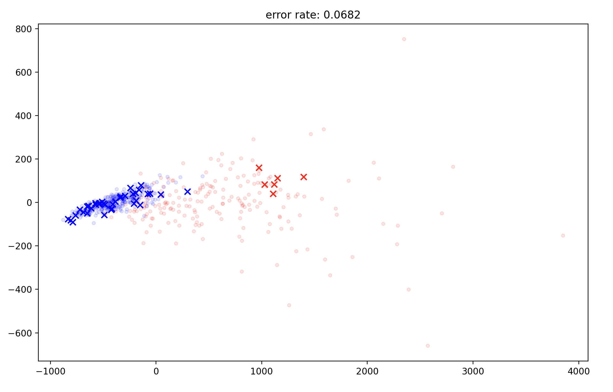
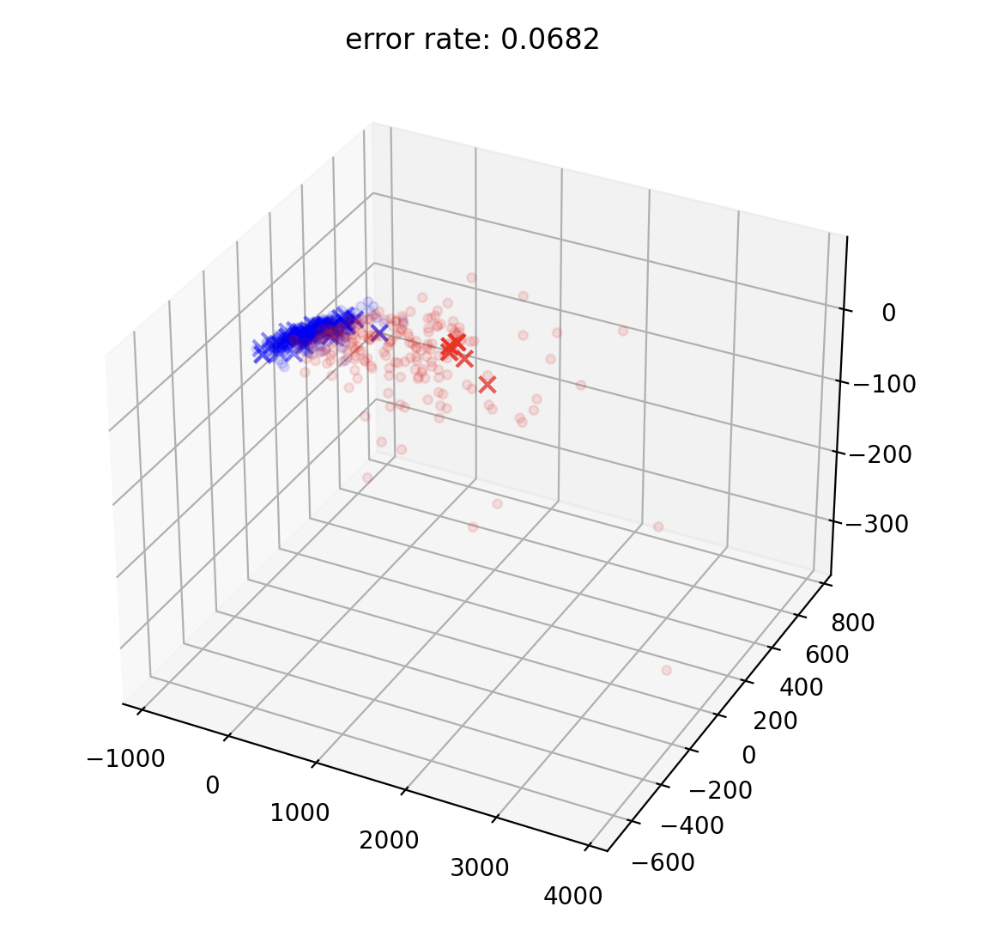
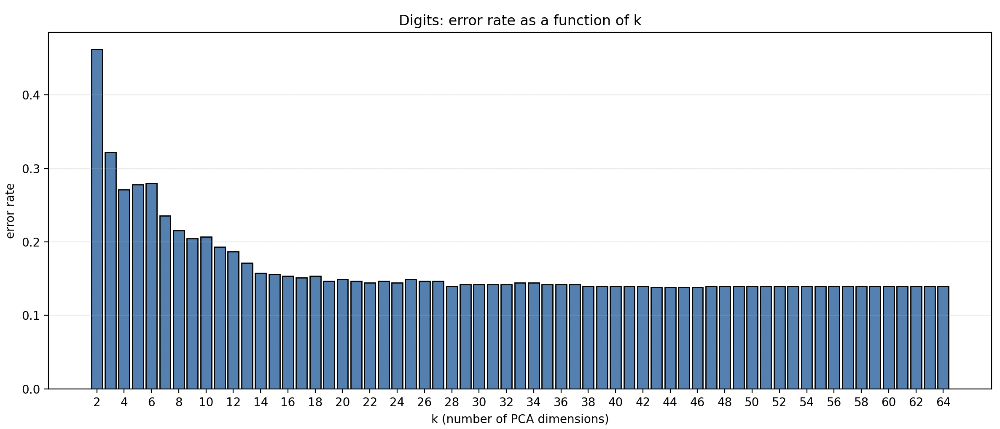

# Principal Component Analysis (PCA) implementation in C++

**Note:** This code is **not meant for production use**. It is neither as fast nor as numerically reliable as  
[`numpy.linalg.eigh`](https://numpy.org/doc/stable/reference/generated/numpy.linalg.eigh.html).

## Usage

For a minimal example, see the following:

```python
import pca

# The matrix to reduce.
# It has shape N × p, where:
# - N is the number of samples in the dataset
# - p is the number of features per sample
M = [
    [2, 1, -1],
    [-4, 2, 0],
    [9, 2, 1],
    [0, -1, 2]
]

# Target dimension
k = 2

res = pca.fit(dataset, 2)

# dataset M reduced to k parameters
M_reduced = res["projected"]

# the base in which the projection as been made and the mean of the initial dataset
# if you want to project some more point: (test - means) @ W
W = res["W"]
means = res["means"]
```

The left image represents the generated data in 3D. You may notice that one axis does not carry much information. In this case, reducing the dimension to 2 is especially interesting because very little information is lost. 
The right image shows the same dataset after applying PCA.

<table align="center">
  <tr>
    <td align="center" width="50%">
      
    </td>
    <td align="center" width="50%">
      
    </td>
  </tr>
</table>

## How it works

If you want more detail on how TCA works and the implementation choices I made, checkout  [How PCA works (PDF)](docs/how_it_works.pdf)

## Why is PCA used?

Using a [Breast Cancer Diagnosis Data Set](https://www.kaggle.com/datasets/uciml/breast-cancer-wisconsin-data?resource=download) you can visualise data in 2d, then project a new entry and calculate the average distance.
You get:

<center>
      
</center>

You can clearly do better than a 7% error rate. Maybe the 3rd more important direction still contains a lot of information. Let's check that out:

<center>
      
</center>

The error rate remains constant. Although this may seem unexpected, it can be explained by the fact that most of the discriminative information is captured by the first two principal components. The additional components mainly introduce noise and do not contribute significantly to class separation.

In contrast, when using a more complex dataset such as [load_digits](https://scikit-learn.org/stable/modules/generated/sklearn.datasets.load_digits.html), where the informative variance is spread across several directions, we can clearly observe how the average error evolves as a function of the number of retained dimensions.

<center>
      
</center>

This highlights another practical use of PCA. As observed, beyond approximately 40 components, the error rate remains almost unchanged. Consequently, reducing the dimensionality to 30–40 components before training a neural network could significantly reduce computational cost without sacrificing performance.