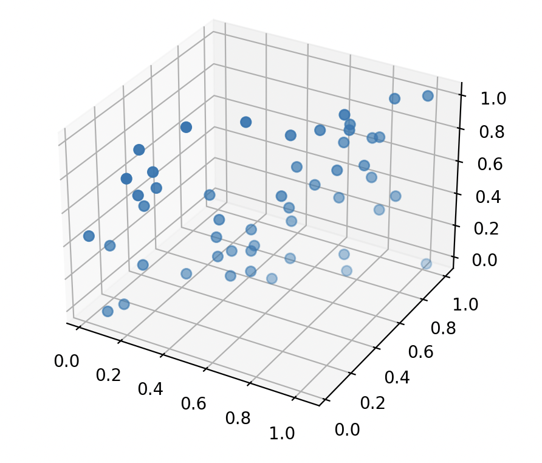
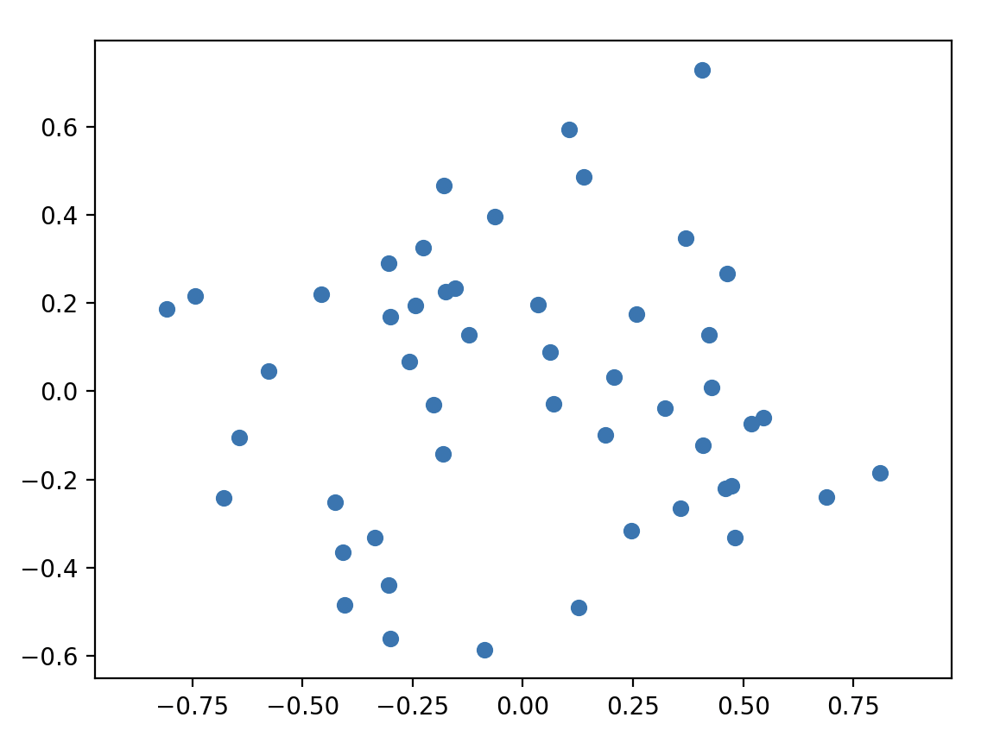

# Principal Component Analysis (PCA) implementation in C++

**Note:** This code is **not meant for production use**. It is neither as fast nor as numerically reliable as  
[`numpy.linalg.eigh`](https://numpy.org/doc/stable/reference/generated/numpy.linalg.eigh.html).

## Usage

For a minimal example, see the following:

```python
import pca

# The matrix to reduce.
# It has shape N × p, where:
# - N is the number of samples in the dataset
# - p is the number of features per sample
M = [
    [2, 1, -1],
    [-4, 2, 0],
    [9, 2, 1],
    [0, -1, 2]
]

# Target dimension
k = 2

M_reduced = pca.run(M, k)

```

If you want to quickly understand why dimensionality reduction is useful, you can follow the example below.

```python
import numpy as np
import matplotlib.pyplot as plt
from random import uniform
import pca

d = 0.05
data3d = np.array([
    [r + uniform(-d, d), r + uniform(-d, d), i / 9]
    for i in range(10)
    for _ in range(5)
    for r in [uniform(0, 1)]
])

fig = plt.figure()
ax = fig.add_subplot(111, projection="3d")
ax.scatter(data3d[:, 0], data3d[:, 1], data3d[:, 2], s=35)
plt.show()

data2d = np.array(pca.run(data3d.tolist(), 2), dtype=float)

plt.figure()
plt.scatter(data2d[:, 0], data2d[:, 1], s=35)
plt.axis("equal")
plt.show()
```

The left image represents the generated data in 3D. You may notice that one axis does not carry much information. In this case, reducing the dimension to 2 is especially interesting because very little information is lost. 
The right image shows the same dataset after applying PCA.

<table align="center">
  <tr>
    <td align="center" width="50%">
      
    </td>
    <td align="center" width="50%">
      
    </td>
  </tr>
</table>

## How it works

Let $X \in \mathcal{M}_{n, p}(\mathbb{R})$ be a matrix of our dataset where n is the number of sambles each composed of p parameters. We want a matrix $R \in \mathcal{M}_{n, k}(\mathbb{R})$ with $k<p$

The first step is to compute $X^TX$ because if we take a random direction $w \in \mathbb{R}^p$ such that $\lVert w \rVert = 1$ then the data projected on this axe will be $Xw$. Because we are looking for the direction who will keep the more information which mean maximize the variance of the projection, we are basically looking for 

$$
\begin{align*}
\operatorname{Var}(Xw) &= \mathbb{E}[(Xw)^2] - \mathbb{E}(Xw)^2\\
                        &= \frac{1}{n}\lVert Xw \rVert^2\\
                        &\propto w^TX^TXw
\end{align*}                        
$$

because if necessary $\tilde{X}_{(i)} = X_{(i)} - \operatorname{mean}(X_{(i)})$ so we can assume that $\mathbb{E}[X]=0$. It is in fact the very first thing to do before computing $X^TX$.
So in order to find our very first direction, we need to find
$$
    \argmax_{\lVert w \rVert\,=\,1}\left\{w^TX^TXw\right\} = \argmax\left\{\frac{w^TX^TXw}{w^Tw}\right\}
$$
We recognize the [Rayleigh quotient](https://en.wikipedia.org/wiki/Rayleigh_quotient). It is know that for a matrix such as $X^TX$ this quantity is maximum for the biggest $\lambda_{max} \in \operatorname{Sp}(X^TX)$ which occurs when $w = v_{max}$, with $v_{max}$ the eigenvector associed to $\lambda_{max}$.

So we found our first direction $w_{1}=v_{max}$. Our intuition tells us that we now have to find the second vector by using the exact same idea but on a new matrix $\tilde{X}$ where all the informations given by $w_{1}$ have been removed:

$$
    \tilde{X}_k=X-\sum_{i=1}^{k-1}Xw_{s}w_{s}^T
$$

We ends up with the same Rayligh quotient with $\tilde{X}_k$. It turns out that the k-th vector $w_k$ we are looking for is the eigenvector corresponding to the k-th biggest eigenvalues. If $\left\{\lambda_1, \dots, \lambda_n \right\}$ are sorted then the $k$ vectors we are looking for are the $\left\{v_1, \dots, v_k \right\}$ corresponding.

Without entering details, those eigenvalues can be calculated using the [QR algorithm](https://en.wikipedia.org/wiki/QR_algorithm). I chosed to use the [Gram-Schmidt process](https://en.wikipedia.org/wiki/Gram–Schmidt_process) to find the QR decomposition. Then It's possible to use [Inverse iteration](https://en.wikipedia.org/wiki/Inverse_iteration) algorithm to find the corresponding eigenvalues. The Inverse iteration algorithm require to inverse matrices for which I used the [Gaussian elimination](https://en.wikipedia.org/wiki/Gaussian_elimination) even thought faster method exists.